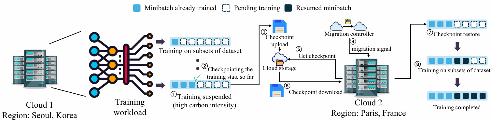
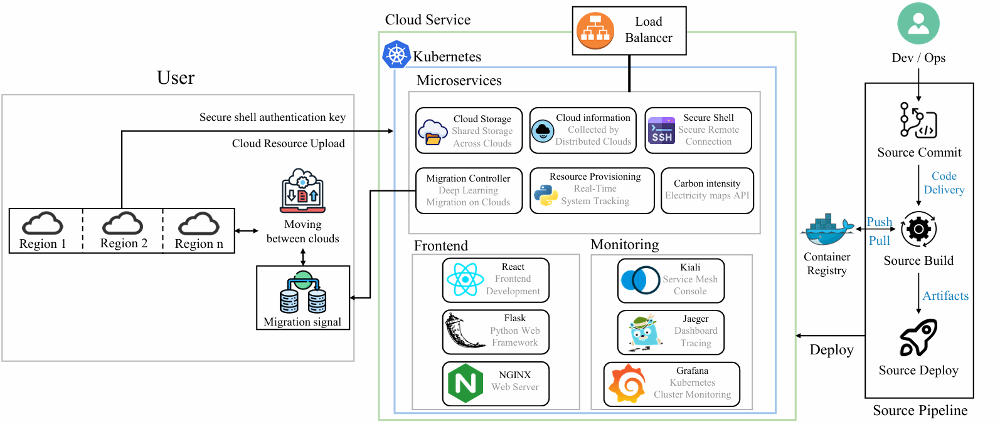
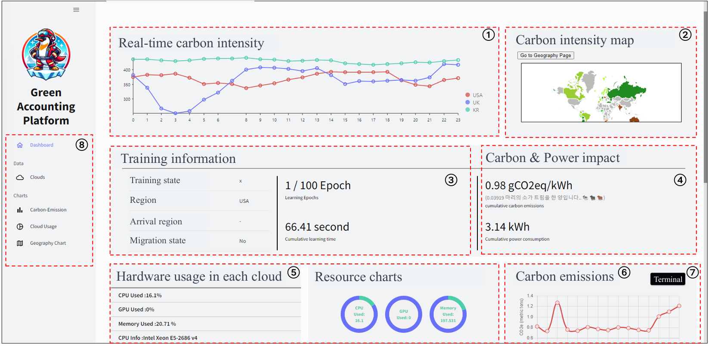

# Green Accounting Platform

Green Accounting Platform is a web carbon management system on a multi-cloud environment. The Green Accounting Platform moves the deep learning training workloads from the location with high carbon intensity to the location with low carbon intensity. Our platform reduces carbon emissions of the deep learning training workloads in geo-distributed clouds while providing fault-tolerant controls.




Green Accounting Platform works in a mini-batch manner and has the following main components:

•	**Carbon Monitoring**: It monitors the carbon intensity of the location where the user trains DL by mini-batches. 

•	**Migration Controller**: Based on the current carbon intensity, the migration controller decides whether to resume the DL training or to stop the training and upload the current learning progress for the migration. When the carbon intensity violates the threshold, the training stops, and the migration starts. Our platform migrates the DL training job to the location that has a lower carbon intensity than the threshold. As the migration controller saved the learning progress beforehand, the user can train DL with the same learning progress. 


---    



Tools and libraries used on Modules:  

Service Mesh  
- Istio: manage the communication between microservices
- Kiali: monitor and visualize the service mesh

Remote Connection  
- SSH: integrate the management of multiple clouds

Carbon Intensity  
- Electricity Maps: trace the worldwide carbon intensity

CI/CD Pipeline
- Github, Git, Actions: protect the source code with a private repository & control the version & configure the automated workflow
- NCLOUD DevOps: build the pipeline using cloud service & manage the deployment process

Database
- Firebase Service: save and synchronize a large amount of real-time data safely

Container Orchestration
- Docker, Kubernetes: containerize the service to deploy and run independently

Monitoring
- JAEGER: trace the flow of service demand 
- Grafana: monitor system performance
- Glances: manage the overall server status

Dashboard Configuration
- React, JS, HTML, CSS: build an interactive dashboard

Data Processing
- Pandas, Numpy: analyze & calculate the data
- Psutil, Dataprep: monitor the system performance & preprocess the data

---




This is the dashboard of our platform. The dashboard contains the following components:
1. Real-time carbon intensity
    - Display the real-time carbon intensity of currently connected clouds
   
2. Carbon intensity map
    - Visualize the worldwide carbon intensity on the map

3. Training information
    - Display the learning process of training the deep learning

4. Carbon & Power impact
    - Display the cumulative carbon emission and power used by training the deep learning

5. Hardware usage in each cloud
    - Display the hardware information of the currently working cloud along with the resource usage status

6. Carbon emissions
    - Visualize the carbon emission from the training process

7. Terminal
    - Access to the currently used cloud for detailed information and manual commands

8. Detailed pages
    - Display more detailed information from the main dashboard

---

## Installation and Setup
### Prerequisities: Connect the github to the cloud services that can build the pipeline and deploy the service with docker and kubernetes
For the cloud service, we have utilized the naver cloud to connect our code to the CI/CD process. You can use any cloud service, as long as it can get the code input as a trigger and use yaml file for the CI/CD process with the docker and kubernetes. Please check our workflow files from each git branches and git actions. The deployment of four backend branches should be preceded before the frontend branch in the cloud service. Once you build the deployment pipeline in that order, the rest of process will be automated with the yaml file in `.github/workflows`. 

### ssh data file for the test in cloud environment
To test our platform in the cloud environment, you need `ssh_data.csv` file as the following format:
|IP Address of Cloud Server|Username|Password|Port|Country Code|Country Name|
|-----------------|----------|--------|----|------|---|
|x.x.x.x|GreenAccountingPlatform|1234|10002|KR|Korea|

### Training the deep learning in the docker container
Once you deploy our platform in the cloud service, you can access to the terminal and start training.
> **For example, you may use the following command to train VGGNet deep learning model:**
```bash
$ docker run -it --gpus all python3 VGGNet/train.py --epoch 100 --lr 0.001 --batch 8 --vgg_model VGG16 --cuda 0 --step_size 30 --gamma 0.1 --resumption 0 --ssh_server 0 --threshold 250 
```
User can monitor the training process from the dashboard. Our platform will automatically migrate the training once it violates the threshold. Our platform will find the appropriate candidates from the registered cloud services.

### Role of each branch
1. main
    - Synchronize all branches for the deployment on the cloud service
    - Trigger the git action whenever the commit command happens in any branch  
2. back
    - Connect the cloud servers to our platform with ssh service
    - Register the cloud servers for the migration
3. back1
    - Monitor the cloud server resources
4. back2
    - Monitor the carbon intensity
5. back3
    - Orchestrate the migration process
6. front
    - Manage the communication among the micro services from all four backend branches internally
    - Manage the access from the user to our platform through kubernetes load balancer and NGINX-Ingress Service

---
## License

MIT License

Copyright (c) 2025 Data science labs at Dong-A University

Permission is hereby granted, free of charge, to any person obtaining a copy
of this software and associated documentation files (the "Software"), to deal
in the Software without restriction, including without limitation the rights
to use, copy, modify, merge, publish, distribute, sublicense, and/or sell
copies of the Software, and to permit persons to whom the Software is
furnished to do so, subject to the following conditions:

The above copyright notice and this permission notice shall be included in all
copies or substantial portions of the Software.

THE SOFTWARE IS PROVIDED "AS IS", WITHOUT WARRANTY OF ANY KIND, EXPRESS OR
IMPLIED, INCLUDING BUT NOT LIMITED TO THE WARRANTIES OF MERCHANTABILITY,
FITNESS FOR A PARTICULAR PURPOSE AND NONINFRINGEMENT. IN NO EVENT SHALL THE
AUTHORS OR COPYRIGHT HOLDERS BE LIABLE FOR ANY CLAIM, DAMAGES OR OTHER
LIABILITY, WHETHER IN AN ACTION OF CONTRACT, TORT OR OTHERWISE, ARISING FROM,
OUT OF OR IN CONNECTION WITH THE SOFTWARE OR THE USE OR OTHER DEALINGS IN THE
SOFTWARE.


